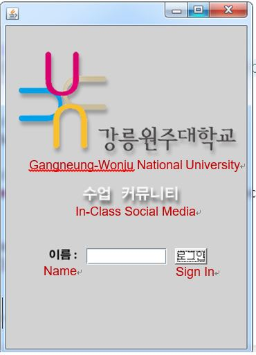
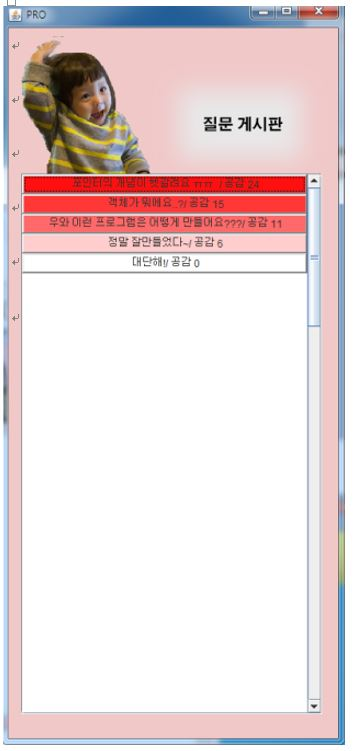

In-Class Social Media
=====================

"Don't raise your hand! Just like!" 
An in-class social medium where students can anonymously raise questions without having to interrupt the class. Questions are shown in a question box on individual computer screens and can be liked by other students, whose color changes as the number of likes increases. Java was used. 

## Execution Window - Students

**SIGN IN**

**DEFAULT FIELDS**

**EXAMPLE**

## Execution Window - Professors
*Question boxes disappear when the professor clicks them.*

*Students’ chats are not displayed in professor’s execution window.*

