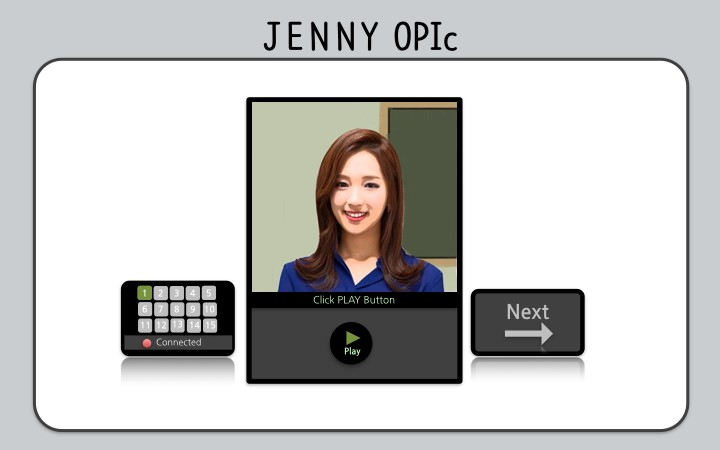
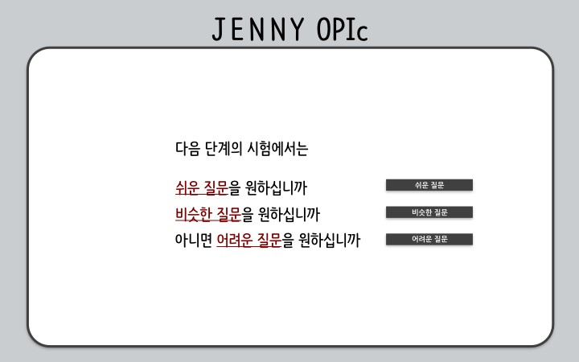

OPIC Test Prep
==============
A test preparation program for OPIc, a computer-based oral test for second language learners in face-to-face interview format. This program was created based on playing/recording audio files function of java, and was used by about 300 test-takers in Jan-Feb, 2016.

Its environment was designed to be as close to the actual test as possible. Users can listen to the question by clicking ‘play’ button, and choose to replay it once by clicking ‘replay’ button within three seconds, which then changes to ‘recording’, indicating that recording has automatically begun (picture 1). At the end of seventh question, the user is asked if (s)he wants to adjust the level of following questions to be easier / same / more difficult (picture 2). After ending the test, users can check the recorded files. 

 “picture 1”

“picture 2”
